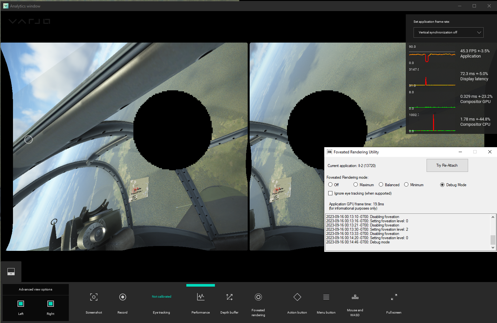

# Pimax Foveated Rendering interoperability with Varjo (and more)

## What does it do?

This utility lets you use the Pimax Foveated Rendering feature with headsets other than Pimax. It re-implements a few parts of the Pimax PVR API (publicly available [from Pimax's website](https://developer.pimax.com/document/sdk/native/native-pc-xr-sdk.html)) to allow the Pimax Foveated Rendering code to run. It uses the `MagicAttach` tool available from the Pimax Play software to initiate Foveated Rendering into the currently running SteamVR OpenVR application.

**IF YOU HAVE A PIMAX HEADSET, YOU DO NOT NEED THIS UTILITY!**

**If you have a Varjo headset, you will be able to use Dynamic Foveated Rendering (with eye tracking).**

**If you have any other headset, you will only be able to use Fixed Foveated Rendering.**

## Installing

1) Install [Pimax Play](https://pimax.com/pimax-pc) from the Pimax website. This is temporary, you can uninstall it after we grab the necessary files.
**At time of writing, Pimax Play 1.16 was successfully tested.**

2) Go to `%ProgramFiles%\Pimax\Runtime` and copy the following files to a staging folder: `LibMagicD3D1164.dll` and `MagicAttach_x64.exe`. 
These are the only files you need, you can then uninstall Pimax Client entirely.

3) Download the Foveated Rendering Utility from the [Releases](https://github.com/mbucchia/PimaxMagic4All/releases) page. Unzip the Foveated Rendering Utility in the folder of your choice.

4) Copy the `LibMagicD3D1164.dll` and `MagicAttach_x64.exe` files obtained in step 2) into the folder created in step 3).
The `LibMagicD3D1164.dll` and `MagicAttach_x64.exe` shall be next to the `DFR-UI.exe` file.

5) Copy the `libpvrclient64.dll` and `VarjoLib.dll` filed from the folder created in step 3) into the `%SystemRoot%\System32` folder (aka: `C:\Windows\System32`).

6) (For Varjo users) Start Varjo Base and make sure eye tracking is calibrated and allowed for applications (search 'Privacy' settings under 'System').

## Reminders on Pimax Foveated Rendering

Pimax Foveated Rendering does not work in all applications.

Eligible applications must meet the following requirements:
- Use OpenVR (as opposed to Oculus mode or OpenXR). OpenComposite is not supported;
- Use Direct3D 11;
- Allow 3rd party code injection (blocked by software such as Easy Anti-Cheat).

In addition to that, PimaxMagic4All adds the following requirements:
- Application must be 64-bit.

Then there are applications that meet all the requirements above, but still will not work.

Here are examples of applications that **do not work** with Pimax Foveated Rendering (and why):
- Microsoft Flight Simulator (OpenXR)
- No Man's Sky (Vulkan)
- X-Plane 11 & 12 (Vulkan)
- F1 2022 (Direct3D 12)
- VR Chat (Easy-Anti Cheat)
- Automobilista 2 (Does not work)

For alternative solutions, check out [OpenXR Toolkit](https://mbucchia.github.io/OpenXR-Toolkit/), [vrperfkit](https://github.com/fholger/vrperfkit) and [Quad-Views-Foveated](https://github.com/mbucchia/Quad-Views-Foveated/wiki).

## Running

Double-click `DFR-UI.exe`. **This app must be running in order to initiate Foveated Rendering.**


Start SteamVR and the game of your choice. Enable Foveated Rendering in the user interface.

If all went well, you will now have foveated rendering in your app.


## Frequently Asked Questions (FAQ)

**Q:** I am having an issue with foveated rendering in game XYZ, can you fix it?

**A:** No, I have no control over the foveated rendering part, it is all done by Pimax's software.

**Q:** I own a Pimax headset and also a second headset. How do I handle copying the `libpvrclient64.dll` file in my System folder?

**A:** You have no choice but to restore the original `libpvrclient64.dll` from Pimax before using your Pimax headset, and copy back the PimaxMagic4All copy of it into your System folder when switching to your other headset.

**Q:** Can you add support for eye tracking with my Quest Pro/Pico Pro/"insert name of headset"?

**A:** No I will not add support for other eye trackers. Most of these headsets do not expose public APIs for raw access to the eye tracker. The code is open source is very simple if you want to take a stab at it.

## Troubleshooting

### First things to try

- Restart the `DFR-UI.exe` utility.

- Try pressing the "Try Re-Attach" button.

### Via log file

You can inspect the log file at the bottom of the `DFR-UI` tool (which is loaded from `%LocalAppData%\PvrEmu\PvrEmu.log`).

```
2023-07-11 23:43:33 -0700: Hello World from 'F:\SteamLibrary\steamapps\common\assettocorsa\acs.exe'!
2023-07-11 23:43:33 -0700: Requested PVR SDK: 1.24
2023-07-11 23:43:33 -0700: Varjo SDK: 3.10.0.6
2023-07-11 23:43:33 -0700: Detected IPD: 0.0635
```

If you see the stuff above, it's a good start, the loading into the game process succeeded, and Varjo initialized OK. The key line you want to look for next is:

```
2023-07-11 23:43:33 -0700: Foveation is active
```

That line means that the process was successfully hooked and foveated rendering is possible. If you don't see that, then the app cannot support foveated rendering.

### Via debug mode

In _certain applications_ (not all), the "Debug Mode" option can be used to visualize the eye gaze. This can both show that eye tracking is working, and also that variable rate shading is being injected into the application.


