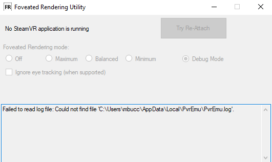
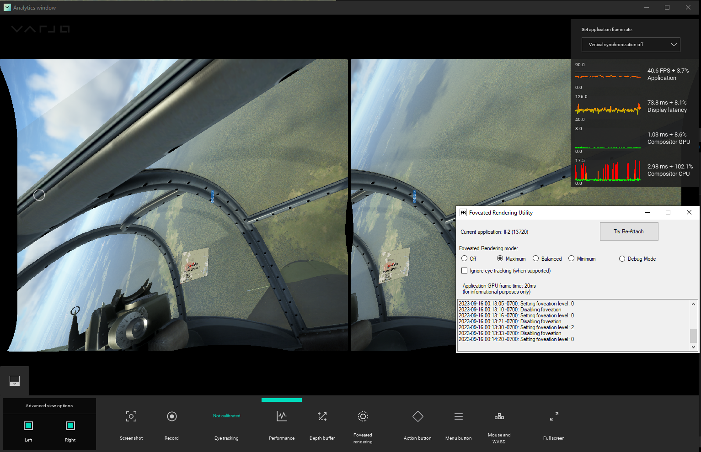

# Pimax Foveated Rendering for All

## What does it do?

This utility lets you use the Pimax Foveated Rendering feature with headsets other than Pimax. It re-implements a few parts of the Pimax PVR API (publicly available [from Pimax's website](https://developer.pimax.com/document/sdk/native/native-pc-xr-sdk.html)) to allow the Pimax Foveated Rendering code to run without the rest of the Pimax software. It uses the `MagicAttach` tool available from the Pimax Play software to initiate Foveated Rendering into the currently running SteamVR OpenVR application.

Pimax is a Virtual Reality headset vendor who most recently released the [Pimax Crystal](https://pimax.com/crystal/), a high-end headset with support for eye tracking and therefore Dynamic Foveated Rendering (DFR) through their software suite.

**!!! IF YOU USE A PIMAX HEADSET YOU DO NOT NEED THIS UTILITY !!!**

# More details and instructions on the [the wiki](https://github.com/mbucchia/PimaxMagic4All/wiki)!

## Installing

**PLEASE READ ALL THE INSTRUCTIONS BELOW CAREFULLY.**

1) Install [Pimax Play](https://pimax.com/pimax-pc) from the Pimax website. This is temporary, you can uninstall it after we grab the necessary files.
**At time of writing, Pimax Play 1.16 was successfully tested.**

2) Download the Foveated Rendering Utility from the [Releases](https://github.com/mbucchia/PimaxMagic4All/releases) page. Unzip the Foveated Rendering Utility in the folder of your choice.

3) Go to `%ProgramFiles%\Pimax\Runtime` and copy the `LibMagicD3D1164.dll` and `MagicAttach_x64.exe` files into the folder created in step 2). 
**The `LibMagicD3D1164.dll` and `MagicAttach_x64.exe` shall be next to the `DFR-UI.exe` file.**

4) You can now uninstall Pimax Play.

Please refer to the wiki for additional steps specific to your headset in order to enable eye tracking (when applicable).

## Running

Double-click `DFR-UI.exe`.

**This app must be running in order to initiate Foveated Rendering.**

**If you want to run a game WITHOUT Foveated Rendering, you can simply make sure that `DFR-UI` is NOT OPEN when you start your game!**

Start SteamVR and the game of your choice. Enable Foveated Rendering in the user interface through the setting of your choice (Maximum means best performance but possibly more noticeable degradation in quality).

If all went well, you will now have foveated rendering in your app. In case of doubt, see [Troubleshooting](#troubleshooting) for ways to check whether a game is working properly.

## Troubleshooting

- Restart the `DFR-UI.exe` utility.

- Try pressing the "Try Re-Attach" button.
